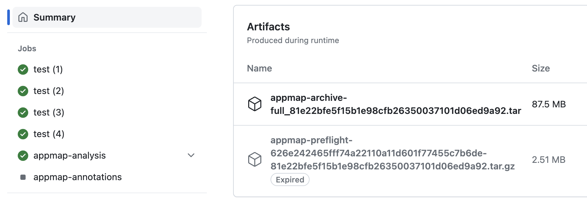
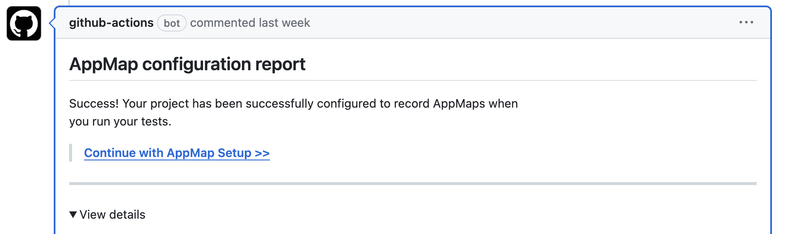

# getappmap/archive-appmap <!-- omit from toc -->

> To get started with AppMap in GitHub actions, you need to start by installing the
> [AppMap App on the official GitHub Marketplace](https://github.com/marketplace/get-appmap)
>
> To see a step-by-step example of how to install this action into your software project,
> [review the official AppMap Documentation](http://appmap.io/docs/analysis/in-github-actions).

`getappmap/archive-action` is a GitHub Action used during initial setup of AppMap in CI to create a
Configuration report. It's also used in matrix builds to create an archive of AppMaps on a worker
node and save them to the GitHub cache. Finally, it's used when a PR is merged (both in matrix and
non-matrix mode) to build and store a baseline artifact. This is also done on a schedule (cron) to
ensure that the artifacts don't expire and disappear.

`getappmap/archive-action/merge` is an action used to merge AppMaps created in a matrix build into
one unified archive.

_Note_ Default GitHub artifact expiration is 90 days. This is a configurable GitHub org or project
setting.

## Table of contents <!-- omit from toc -->

- [Requirements](#requirements)
- [Inputs](#inputs)
  - [`getappmap/archive-action`](#getappmaparchive-action)
  - [`getappmap/archive-action/merge`](#getappmaparchive-actionmerge)
- [Effects](#effects)
  - [Creation of artifact 'appmap-archive-full'](#creation-of-artifact-appmap-archive-full)
  - [Submission of PR comment 'AppMap configuration report'](#submission-of-pr-comment-appmap-configuration-report)
- [Examples](#examples)
  - [Initial Setup (`pull_request` workflow trigger)](#initial-setup-pull_request-workflow-trigger)
  - [Matrix Build (`pull_request` workflow trigger)](#matrix-build-pull_request-workflow-trigger)
- [Development](#development)

## Requirements

1. Your project must be configured to run tests with AppMap enabled.
   [`getappmap/install-action`](https://github.com/getappmap/install-action) is a companion GitHub
   Action that can be used to do this automatically. For more information about how to setup AppMap
   in your project
   [review the official AppMap Documentation](http://appmap.io/docs/analysis/in-github-actions).
2. `getappmap/archive-action` needs to run AFTER your test cases have executed, so that there will
   be AppMaps for it to process.

## Inputs

### `getappmap/archive-action`

Add a step like this to your workflow:

```yaml
- name: Archive AppMaps
  uses: getappmap/archive-action@v1
  with:
    # Command working directory. Use this option this to install AppMap to a
    # subdirectory of a monorepo / multi-folder project. When this input is specified,
    # AppMaps that project will be written to the directory `$directory/tmp/appmap`.
    # Be aware of this in any subsequent steps.
    # Default: '.'
    directory: ./projects/backend

    # 0-based numerical id of a matrix job. This id is used to store the AppMap
    # archive in the action cache. Once the matrix jobs complete, the `merge`
    # action can be used to merge the archives into a single archive, and then
    # save it as an artifact. If `archive-id` is set, the archive is saved to the
    # cache. Otherwise, it's uploaded to the artifact store. For a non-matrix
    # job, `archive-id` should not be used.
    # Required for Multi-runner matrix builds.
    archive-id: ${{ matrix.ci_node_index }}

    # Revision (commit SHA) to name the AppMap archive with. The default is the
    # GITHUB_SHA. Under normal circumstances, the default value is correct
    # and this input does not need to be specified.
    revision: 6056b0cfbacd562f4a4f274122c4a5e85542e040

    # The GitHub token to used to interact with GitHub Caches, Pull Requests, etc.
    # Default: `${{ github.token }}`
    github-token: secrets.CUSTOM_GITHUB_TOKEN

    # Number of worker threads to use for processing the archive. Defaults to the
    # number of CPUs / cores, as reported by Node.js. If the worker machine has
    # a high number of CPUs/cores, the archive action may become I/O-bound rather
    # than CPU-bound, and better performance might be obtained by setting this
    # value to a lower number.
    # Default: One worker thread for each core.
    thread-count: 4

    # Enable verbose logging of CLI subcommands. You can use the standard GitHub
    # Action log level option to control verbosity of this Action itself.
    # Default: false
    verbose: true
```

### `getappmap/archive-action/merge`

Add a step like this to your workflow.

```yaml
- name: Merge AppMaps
  uses: getappmap/archive-action/merge@v1
  with:
    # Command working directory. Use this option this to install AppMap to a
    # subdirectory of a monorepo / multi-folder project. When this input is specified,
    # AppMaps that project will be written to the directory `$directory/tmp/appmap`.
    # Be aware of this in any subsequent steps.
    # Default: '.'
    directory: ./projects/backend

    # Revision (commit SHA) to name the AppMap archive with. The default is the
    # GITHUB_SHA. Under normal circumstances, the default value is correct
    # and this input does not need to be specified.
    revision: ${{ github.event.pull_request.base.sha }}

    # Set this equal to the total number of test runners (i.e. total archives created)
    archive-count: 2

    # Enable verbose logging of CLI subcommands. You can use the standard GitHub
    # Action log level option to control verbosity of this Action itself.
    # Default: false
    verbose: true
```

## Effects

### Creation of artifact 'appmap-archive-full'

Both `getappmap/archive-action` and `getappmap/archive-action/merge` create an AppMap archive file,
which is a compressed TAR file. `getappmap/archive-action` uploads the archive to the GitHub
artifact store, unless it's running in matrix mode (), in which case the archive is stored to the
GitHub Actions cache. `getappmap/archive-action/merge` always uploads the archive to the GitHub
artifact store.

The archive is named for the commit SHA that was used to generate it. For example, if the commit SHA
is `6056b0cfbacd562f4a4f274122c4a5e85542e040`, the archive will be named
`appmap-archive-full_6056b0cfbacd562f4a4f274122c4a5e85542e040.tar`.

During initial setup, the `getappmap/archive-action` is run by a pull request workflow trigger, and
the revision is the base revision of the pull request. During ongoing operation, the
`getappmap/archive-action` is run either by a `push` trigger on merge to the main branch, or by a
schedule (cron) trigger, and the revision is the HEAD revision of the main or pull request
integration branch (e.g. `main`, `master`, `develop`).

You can view all artifacts created by a workflow by visiting the `Actions` tab in GitHub and looking
for the `Summary` section.



**Note** The AppMap archive will be retained for the default retention period specified in your
GitHub account.

### Submission of PR comment 'AppMap configuration report'

When `getappmap/archive-action` is run in a pull request context with the `revision` equal to
`${{ github.event.pull_request.base.sha }}`, it will submit a comment to the pull request entitled
`AppMap configuration report`.



For a live example, see this
[sample Django (Python) pull request](https://github.com/land-of-apps/sample_django_app/pull/9#issuecomment-1768614384).

The `AppMap configuration report` primarily provides confirmation that the initial setup step of
configuring the project to run tests with AppMap was successful. It also provides information about
what type of information has been recorded in the AppMaps, such as:

- Which code has been recorded.
- What HTTP server requests routes have been observed.
- What SQL queries have been observed.

**Note** Creation of this PR comment requires the permission `pull-requests: write`.

## Examples

### Initial Setup (`pull_request` workflow trigger)

This example is used during installation to build an AppMap archive based on the base SHA of the
setup Pull Request:

```yaml
- name: Archive AppMaps
  uses: getappmap/archive-action@v1
  with:
    revision: ${{ github.event.pull_request.base.sha }}
```

### Matrix Build (`pull_request` workflow trigger)

This example shows how to use the archive actions in a matrix build to archive the AppMaps on each
worker node, then to combine them together for analysis.

To learn more about how to setup a multi-build matrix runner with AppMap refer to the
[AppMap Documentation](https://appmap.io/docs/setup-appmap-in-ci/matrix-builds.html)

Use the `archive-id` when building a multi-runner matrix build. Set the `archive-id` equal to the
unique index ID of the runner which executed the build. For example, if you have split your runners
with the following strategy.

```yaml
strategy:
  fail-fast: false
  matrix:
    ci_node_total: [2]
    ci_node_index: [0, 1]
```

In this example, you will use the `matrix.ci_node_index` variable to set either `0` or `1` as the
unique node index ID for the `archive-id`.

**NOTE:** The `if: always()` is used to ensure that the AppMap Archive is generated even if there
are failed test cases. The failed test cases will be included in the AppMap analysis report. Since
the `archive-id` is being passed to the action, the `archive-action` will save the AppMaps from this
runner to the GitHub build cache. After this step you will use the `archive-action/merge` action to
merge and archive AppMaps as a build asset.

```yaml
- name: Archive AppMaps
  if: always()
  uses: getappmap/archive-action@v1
  with:
    archive-id: ${{ matrix.ci_node_index }} # Set this equal to the unique index of the runner
```

In a build job after all multi-runners have completed, use this to merge and archive the individual
runners maps. This `getappmap/archive-action/merge@v1` action will both merge and archive the
AppMaps.

```yaml
- name: Merge AppMaps
  uses: getappmap/archive-action/merge@v1
  with:
    revision: ${{ github.event.pull_request.base.sha }}
    archive-count: 2 # Set this equal to the total number of test runners (i.e. total archives created)
```

For more examples, refer to the
[AppMap example projects](https://appmap.io/docs/setup-appmap-in-ci/example-projects.html)

## Development

```
# Remove build artifacts
$ yarn clean

# Build the project
$ yarn build

# Run tests
$ yarn test

# Package the project into a distributable GitHub action
$ yarn package
```
